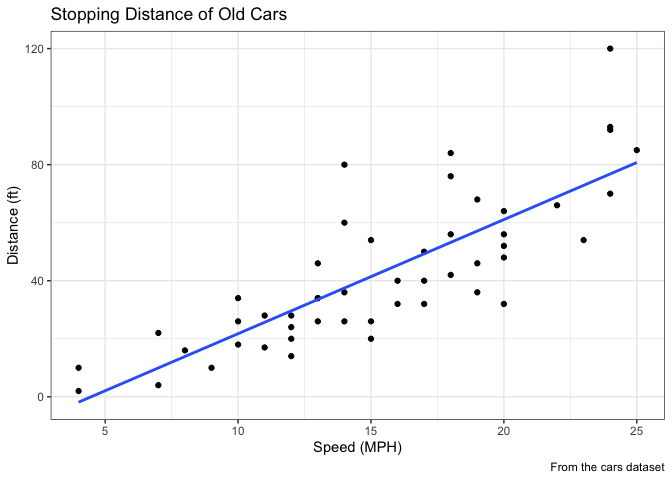
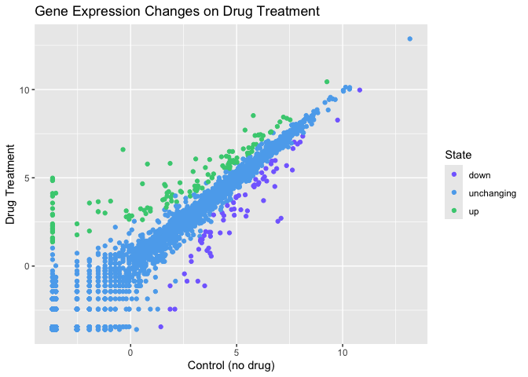
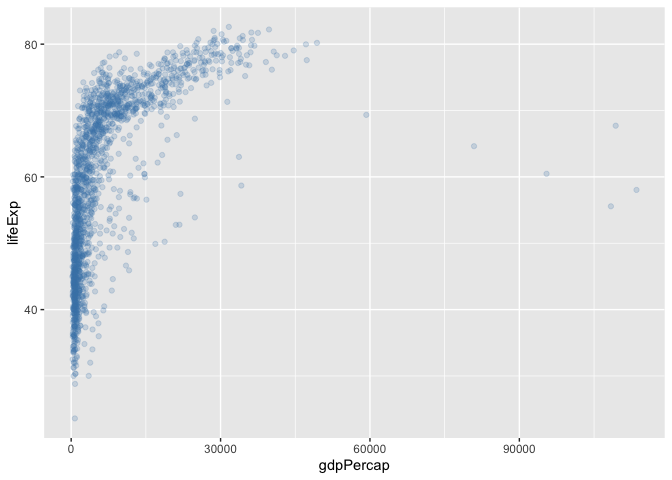
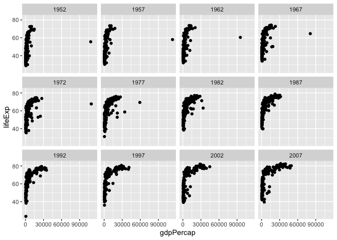

# Class 5: Data Visualization with ggplot
Dani Baur (A16648266)

- [A more complicated scatterplot](#a-more-complicated-scatterplot)
- [Exploring the gapminder dataset](#exploring-the-gapminder-dataset)

Today we will have our first play with the **ggplot2** package - one of
the most popular graphics packages on the planet.

There are many plotting systems in R. These include so-called *“base”*
plotting/graphics.

``` r
plot(cars)
```


Base plot is generally rather short code and somewhat dull plots - but
it is always there for you and is fast for big datasets.

If I want to use **ggplot2** it takes some more work.

``` r
#ggplot(cars)
```

I need to install the package first to my computer. To do this, I can
use the function `install.packages("ggplot2")`

Every time I want to use a package I need to load it up with a
`library()` call.

``` r
library(ggplot2)
```

Now finally I can use ggplot.

``` r
ggplot(cars)
```


Every ggplot has at least 3 things:

- **data** (the data.frame with the data you want to plot)
- **aes** (the aesthetic mapping of the data to the plot)
- **geom** (how do you want the plot to look- points, lines etc.)

``` r
ggplot(cars) +
aes(x=speed, y=dist) +
  geom_point() + 
  geom_smooth()
```

    `geom_smooth()` using method = 'loess' and formula = 'y ~ x'


``` r
ggplot(cars) +
aes(x=speed, y=dist) +
  geom_point() + 
  geom_smooth(method=lm, se=FALSE) + 
  labs(title="Stopping Distance of Old Cars", 
       x="Speed (MPH)", 
       y="Distance (ft)",
       caption="From the cars dataset") +
  theme_bw()
```

    `geom_smooth()` using formula = 'y ~ x'



## A more complicated scatterplot

Here we make a plot of gene expression data:

``` r
url <- "https://bioboot.github.io/bimm143_S20/class-material/up_down_expression.txt"
genes <- read.delim(url)
head(genes)
```

            Gene Condition1 Condition2      State
    1      A4GNT -3.6808610 -3.4401355 unchanging
    2       AAAS  4.5479580  4.3864126 unchanging
    3      AASDH  3.7190695  3.4787276 unchanging
    4       AATF  5.0784720  5.0151916 unchanging
    5       AATK  0.4711421  0.5598642 unchanging
    6 AB015752.4 -3.6808610 -3.5921390 unchanging

``` r
nrow(genes)
```

    [1] 5196

``` r
colnames(genes)
```

    [1] "Gene"       "Condition1" "Condition2" "State"     

``` r
ncol(genes)
```

    [1] 4

``` r
table(genes$State)
```


          down unchanging         up 
            72       4997        127 

``` r
round (sum(genes$State == "up") / nrow(genes) *100,2)
```

    [1] 2.44

``` r
n.gene <- nrow(genes)
n.up <- sum(genes$State == "up")

up.percent <- n.up/n.gene*100
round(up.percent,2)
```

    [1] 2.44

``` r
ggplot(genes) +
  aes(x=Condition1, y=Condition2, col=State) +
  geom_point() +
  scale_colour_manual(values=c("slateblue1","steelblue2","seagreen3")) +
  labs(title="Gene Expression Changes on Drug Treatment",
x="Control (no drug)", 
y="Drug Treatment")
```



## Exploring the gapminder dataset

Here we will load up the gapminder dataset to get practice with
different aes mappings.

``` r
url <- "https://raw.githubusercontent.com/jennybc/gapminder/master/inst/extdata/gapminder.tsv"
gapminder <- read.delim(url)
```

How many entry rows/columns are there in this dataset?

``` r
nrow(gapminder)
```

    [1] 1704

``` r
ncol(gapminder)
```

    [1] 6

``` r
head(gapminder)
```

          country continent year lifeExp      pop gdpPercap
    1 Afghanistan      Asia 1952  28.801  8425333  779.4453
    2 Afghanistan      Asia 1957  30.332  9240934  820.8530
    3 Afghanistan      Asia 1962  31.997 10267083  853.1007
    4 Afghanistan      Asia 1967  34.020 11537966  836.1971
    5 Afghanistan      Asia 1972  36.088 13079460  739.9811
    6 Afghanistan      Asia 1977  38.438 14880372  786.1134

``` r
tail(gapminder)
```

          country continent year lifeExp      pop gdpPercap
    1699 Zimbabwe    Africa 1982  60.363  7636524  788.8550
    1700 Zimbabwe    Africa 1987  62.351  9216418  706.1573
    1701 Zimbabwe    Africa 1992  60.377 10704340  693.4208
    1702 Zimbabwe    Africa 1997  46.809 11404948  792.4500
    1703 Zimbabwe    Africa 2002  39.989 11926563  672.0386
    1704 Zimbabwe    Africa 2007  43.487 12311143  469.7093

``` r
table(gapminder$year)
```


    1952 1957 1962 1967 1972 1977 1982 1987 1992 1997 2002 2007 
     142  142  142  142  142  142  142  142  142  142  142  142 

``` r
table(gapminder$continent)
```


      Africa Americas     Asia   Europe  Oceania 
         624      300      396      360       24 

I could use `unique()` function…

How many countries are there in this dataset?

``` r
length(unique(gapminder$country))
```

    [1] 142

``` r
ggplot(gapminder) +
  aes(x=gdpPercap, y=lifeExp) +
  geom_point(alpha=0.2, col="steelblue")
```



``` r
library(dplyr)
```


    Attaching package: 'dplyr'

    The following objects are masked from 'package:stats':

        filter, lag

    The following objects are masked from 'package:base':

        intersect, setdiff, setequal, union

``` r
gapminder_2007 <- gapminder %>% filter(year==2007)
```

``` r
ggplot(gapminder_2007) +
  aes(x=gdpPercap, y=lifeExp, col=continent, size=pop) +
  geom_point(alpha=0.5)
```


``` r
ggplot(gapminder_2007) +
  aes(x=gdpPercap, y=lifeExp, col=pop) +
  geom_point(alpha=0.8)
```


``` r
ggplot(gapminder) +
aes(x=gdpPercap, y=lifeExp) +
  geom_point() +
  facet_wrap(~year)
```



``` r
ggplot(gapminder) +
aes(x=gdpPercap, y=lifeExp) +
  geom_point() +
  facet_wrap(~continent)
```


