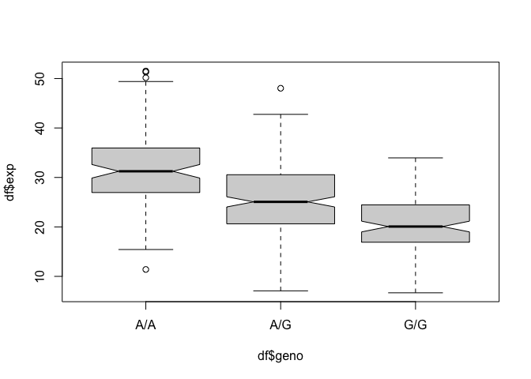

# Section 4: Population Scale Analysis
Dani Baur (A16648266)

**Q13:** Read this file into R and determine the sample size for each
genotype and their corresponding median expression levels for each of
these genotypes.

``` r
expr <- read.table("rs8067378.txt")
head(expr)
```

       sample geno      exp
    1 HG00367  A/G 28.96038
    2 NA20768  A/G 20.24449
    3 HG00361  A/A 31.32628
    4 HG00135  A/A 34.11169
    5 NA18870  G/G 18.25141
    6 NA11993  A/A 32.89721

Sample size \# for each genotype:

``` r
table(expr$geno)
```


    A/A A/G G/G 
    108 233 121 

Sample size % for each genotype:

``` r
table(expr$geno) / nrow(expr)
```


          A/A       A/G       G/G 
    0.2337662 0.5043290 0.2619048 

``` r
df <- data.frame(expr)
zlot <- boxplot(df$exp ~ df$geno, notch=TRUE)
```



``` r
zlot$stats
```

             [,1]     [,2]     [,3]
    [1,] 15.42908  7.07505  6.67482
    [2,] 26.95022 20.62572 16.90256
    [3,] 31.24847 25.06486 20.07363
    [4,] 35.95503 30.55183 24.45672
    [5,] 49.39612 42.75662 33.95602

Median expression level for each genotype:

``` r
zlot$stats[3,]
```

    [1] 31.24847 25.06486 20.07363

**Q14:** Generate a boxplot with a box per genotype, what could you
infer from the relative expression value between A/A and G/G displayed
in this plot? Does the SNP effect the expression of ORMDL3?

``` r
library(ggplot2)
z <- ggplot(expr) +
  aes(geno, exp, fill=geno) +
  geom_boxplot(notch=TRUE)
z
```


Based on this boxplot, there is a notable difference between the
expression levels of A\|A vs G\|G, meaning that the SNP affects the
expression of ORMDL3. This means that when the genotype is homozygous A,
there are higher levels of expression of ORMDL3 while homozygous G has
lower levels of expression of ORMDL3. Also, heterozgyous A\|G has an
expression level in between these values.
